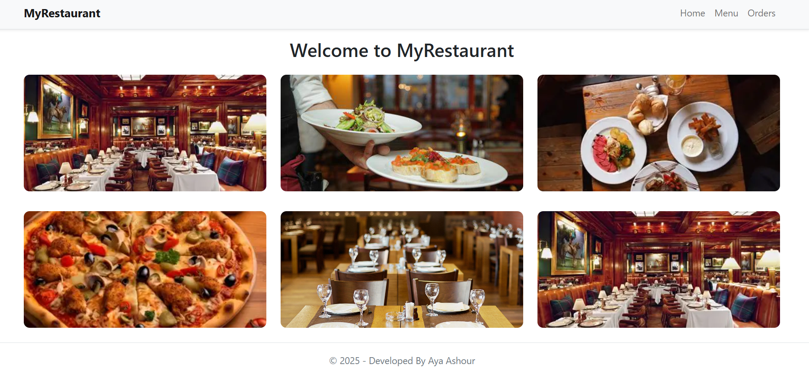
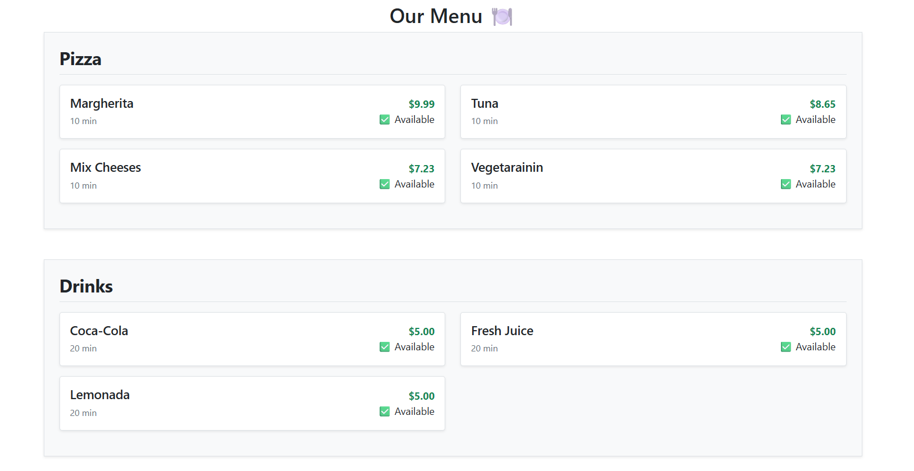
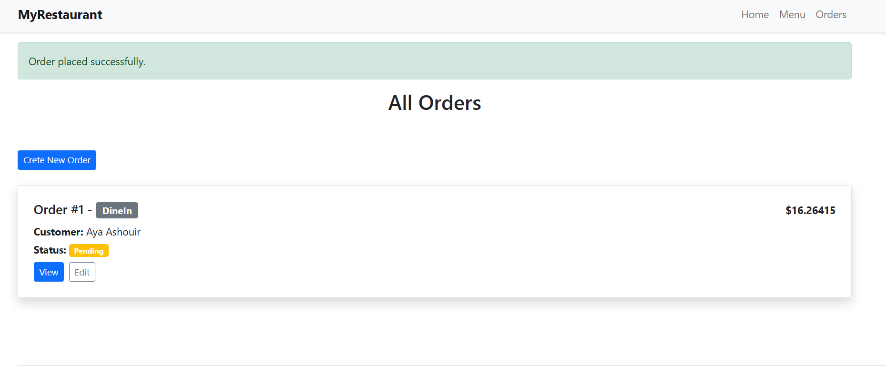

# 🍽️ Restaurant Management System

A full-featured Restaurant Management System built with **ASP.NET Core MVC**, supporting menu management, order processing, inventory simulation, and sales analytics.

---

## 📌 Project Overview

This system allows restaurants to manage their daily operations end-to-end:

- Browse and manage menu items and categories
- Place and track customer orders (Dine-in, Takeout, Delivery)
- Monitor order status from Pending → Preparing → Ready → Delivered
- Generate sales analytics and reports

---

## 🛠️ Tech Stack

| Layer | Technology |
|---|---|
| Framework | ASP.NET Core MVC (.NET 8) |
| Language | C# |
| UI | Razor Views, Tag Helpers, Layouts |
| Data | In-Memory DataRepository (no EF required) |
| Styling | Bootstrap 5 |

---

## ✅ Features

### MVC Architecture
- Models, Views, and Controllers organized by domain
- Convention-Based and Attribute Routing with route constraints
- Custom middleware for business hours enforcement and performance logging
- HttpContext used for request/response customization

### UI & Views
- Shared layout with sections and partial views
- Built-in and custom Tag Helpers
- Form submissions with full model binding (form data, query strings, route values)

### CRUD Operations
Full Create, Read, Update, Delete support for:
- Menu Items
- Menu Categories
- Customer Orders
- Order Items

---

## 💼 Business Logic

### 🍕 Menu Management
- Unavailable items cannot be added to orders
- Prices must be positive (enforced via model validation)
- Categories with no active items are hidden in the menu view
- Items with **more than 50 orders per day** become unavailable until midnight (daily limit reset)

### 📦 Order Processing
- **Total Calculation:** `Sum of OrderItem.Subtotal + 8.5% tax - discounts`
- Delivery orders require a `DeliveryAddress`
- Estimated delivery time = max preparation time of all items + 30 minutes
- Orders in **Ready** or **Delivered** status cannot be cancelled

### 💰 Pricing & Discounts
| Discount | Condition |
|---|---|
| Happy Hour | 20% off between 3:00 PM – 5:00 PM |
| Bulk Discount | 10% off for orders over $100 |

### 🔄 Order Status Flow

```
Pending ──(5 min)──▶ Preparing ──(prep time)──▶ Ready ──▶ Delivered
```

- Status can also be updated manually by kitchen staff via `UpdateStatus`
- Customer notifications simulated via ViewBag messages

### 📊 Inventory Simulation
- Daily order count tracked per menu item in `DataRepository`
- Availability resets at midnight (tracked via static timestamp check)

---

### Run the Project

# Clone the repository
git clone https://github.com/ayaashour2002/mvcProject

# Navigate to project folder
cd RestaurantManagementSystem

# Restore packages
dotnet restore

# Run the application
dotnet run

---
## 📸 Screenshots

### Home


### Menu


### Orders


